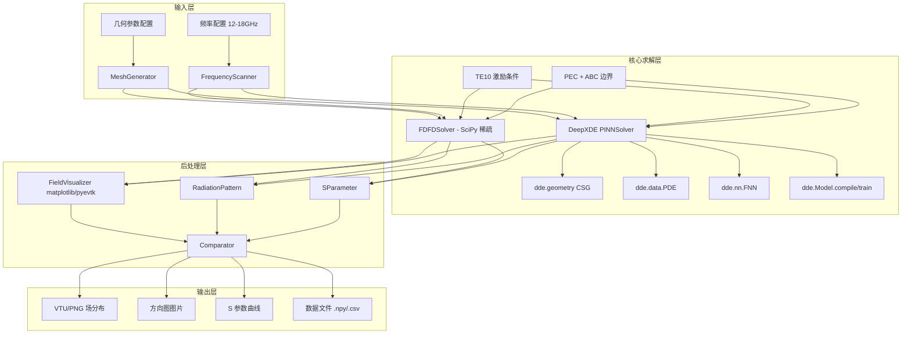

## 用户需求

开发雷达矩形波导辐射槽的电磁仿真系统，使用有限差分频域(FDFD)方法求解 Ku 波段(12-18GHz)电磁场分布，计算辐射方向图和 S 参数，并使用 **DeepXDE** 实现的 PINN 方法对比验证。

## 产品概述

基于 **DeepXDE** 框架构建完整的雷达辐射槽电磁仿真工具链，支持：

- 矩形波导辐射槽几何建模（CSG 布尔运算）
- FDFD 传统方法求解 Helmholtz 方程（NumPy/SciPy 稀疏求解）
- DeepXDE PINN 方法求解电磁场（多后端可选）
- 频段扫描计算 S 参数（12-18GHz）
- 辐射方向图计算与可视化
- 两种方法对比验证

## 核心功能

1. **几何建模模块**

- 矩形波导结构定义（宽 a=1.02cm，高 b=0.51cm）
- 辐射槽位置和尺寸配置
- 通过 `dde.geometry.Rectangle` + CSG 差集 (`outer - slot_region`) 构造计算域
- FDFD 所需的均匀网格生成函数

2. **FDFD 求解器**

- 基于 NumPy/SciPy 稀疏矩阵的 Helmholtz 方程五点差分离散化
- PEC 边界条件实现
- TE10 模端口激励
- 一阶 Mur 或 PML 吸收边界
- 频段扫描求解（12-18GHz）

3. **DeepXDE PINN 求解器**

- 神经网络输出二维向量 `(Re(E_z), Im(E_z))`，对应复值 Helmholtz 解
- 在 `pde(x, y)` 函数内用 `dde.grad.hessian` 计算 ∂²/∂x² 与 ∂²/∂y²，分别对实部、虚部组装两条残差
- PEC 边界使用 `dde.icbc.DirichletBC(geom, lambda x: 0, boundary_pec, component=...)`
- 端口/远场吸收使用 `dde.icbc.RobinBC`（参考 `examples/pinn_forward/Helmholtz_Sound_hard_ABC_2d.py`）
- 硬约束方案：`net.apply_output_transform`，用距离函数把 PEC 边界乘到输出上
- 频率参数化：可将频率 `f` 作为额外输入维度训练一次得到全频段（参数化 PINN），或针对每个频点单独训练

4. **后处理与可视化**

- 通过 `model.predict(grid_points)` 在均匀网格上恢复场
- matplotlib 绘制 2D 等高图与辐射方向图（极坐标）
- 可选 `pyevtk` 输出 VTK/VTU 文件供 ParaView 查看
- S 参数频率响应曲线
- 数据文件导出（.npy/.csv）

5. **对比验证模块**

- FDFD 与 DeepXDE PINN 结果对比
- L2 相对误差、最大误差、相关系数
- 收敛性分析（loss/iteration 曲线，由 `dde.utils.saveplot` 输出）

## 技术栈

- **PINN 框架**: DeepXDE（本仓库）
- **后端**: TensorFlow 2.x / PyTorch / JAX / PaddlePaddle 任选其一（默认 PyTorch）
- **数值计算**: NumPy, SciPy（FDFD 稀疏求解 `scipy.sparse.linalg.spsolve`）
- **可视化**: Matplotlib，可选 `pyevtk`
- **几何处理**: `dde.geometry`
- **配置管理**: argparse + 可选 YAML

## 实现方案

### 整体策略

采用模块化设计，将仿真系统分为几何建模、FDFD 求解、DeepXDE PINN 求解、后处理四个核心模块。FDFD 模块提供传统数值方法的精确基准解；DeepXDE 模块利用其 `Model + PDE` 数据管线快速搭建 PINN，复用 `examples/pinn_forward/Helmholtz_*.py` 中已验证的 Helmholtz 写法；后处理模块统一处理两种方法的结果输出和对比验证。

### 关键技术决策

1. **仿真维度**: 采用 2D Helmholtz 方程（TE10 模在波导横截面 `E_z(x,y)`），降低计算量
2. **网格策略**: FDFD 使用均匀网格；DeepXDE 使用 `dde.data.PDE` 的伪随机/Hammersley 采样 + 边界采样，并按需开启 `resample` 回调或 RAR
3. **频率处理**: 离散频率点扫描（12-18GHz，步长 0.5GHz）；可选频率参数化 PINN，把 `f` 作为输入第三维
4. **复数处理**: DeepXDE 不支持复数张量，使用实部/虚部双输出，PDE 残差拆成两条
5. **边界条件**:
   - PEC：`DirichletBC(component=0/1)` 设为 0
   - 端口/外边界：`RobinBC` 实现一阶吸收（仿照 `Helmholtz_Sound_hard_ABC_2d.py`）
6. **硬约束（推荐）**: `net.apply_output_transform(lambda x, y: distance(x) * y)`，避免大权重导致训练不稳

### 性能与可靠性

- **FDFD 求解**: 时间 O(N^1.5)（稀疏 LU），空间 O(N)（仅存非零）
- **PINN 求解**: 单频训练 1-2 万次 Adam 迭代 + 可选 L-BFGS 微调
- **内存管理**: 频段扫描分批，FDFD 矩阵按需释放
- **数值稳定性**: FDFD 使用 PML 边界；PINN 用 `tanh`/`sin` 激活，权重 Glorot uniform

## 实现注意事项

### 代码复用（DeepXDE 内）

- 参考 `examples/pinn_forward/Helmholtz_Dirichlet_2d.py`：硬约束、`pde(x, y)` 残差、`Rectangle` 几何
- 参考 `examples/pinn_forward/Helmholtz_Neumann_2d_hole.py`：CSG `outer - inner`、Neumann 边界、按 `outer/inner` 区分边界判定
- 参考 `examples/pinn_forward/Helmholtz_Sound_hard_ABC_2d.py`：复值（实/虚双输出）+ `RobinBC` 一阶 ABC + `loss_weights` 调权
- 复用 `dde.utils.saveplot` 保存损失/训练曲线
- 复用 `dde.callbacks`（如 `EarlyStopping`、`PDEPointResampler`、`ModelCheckpoint`）

### 性能优化

- FDFD 求解使用 `scipy.sparse.csr_matrix` + `spsolve`
- PINN 训练使用 Adam (1e-3) → L-BFGS 混合优化策略（`model.compile("L-BFGS")` 第二阶段）
- 频段扫描可使用 `multiprocessing` 并行 FDFD；PINN 可对不同频率使用 `Variable` 实现迁移热启动
- 可选启用 ZCS（`dde.zcs`）加速高维或多输出梯度计算

### 精度控制

- FDFD 网格密度：λ/10
- PINN 采样密度：`num_domain ≈ (length/(λ/10))²`
- PINN 测试集 `num_test` 取 5× 训练域点数
- 频率步长：0.5GHz 确保 S 参数曲线平滑

### 后端选择

```python
# 在脚本顶部或环境变量中设置
import os
os.environ["DDE_BACKEND"] = "pytorch"   # 或 tensorflow / jax / paddle
import deepxde as dde
```

## 架构设计



## 目录结构

```
examples/radiation_slot/
├── __init__.py                      # 包初始化
├── main.py                          # 主入口脚本，argparse 选择 train/eval/scan
├── geometry.py                      # 几何建模：dde.geometry.Rectangle + CSG，及 FDFD 网格生成
├── fdfd_solver.py                   # FDFD 求解器：稀疏 Helmholtz、PEC、TE10、PML/Mur
├── pinn_solver.py                   # DeepXDE PINN 求解器：pde 残差、BCs、Model 封装
├── postprocess.py                   # 后处理：场可视化、辐射方向图、S 参数计算
├── comparator.py                    # FDFD 与 DeepXDE PINN 结果对比
├── functions.py                     # 自定义工具函数：距离函数、激励剖面、远场积分
├── conf/
│   └── radiation_slot.yaml          # 可选 YAML 配置
└── outputs/                         # 输出目录
    ├── fields/                      # 电磁场图片/VTU
    ├── radiation_pattern/           # 辐射方向图
    ├── s_parameters/                # S 参数曲线
    └── comparison/                  # 对比结果
```

## 关键代码结构

### RadiationSlotGeometry（geometry.py）

```python
from dataclasses import dataclass
import numpy as np
import deepxde as dde


@dataclass
class RadiationSlotGeometry:
    """矩形波导辐射槽几何参数。"""
    waveguide_width: float = 1.02      # 波导宽 a (cm)，对应 TE10 截止频率 ~6GHz
    waveguide_height: float = 0.51     # 波导高 b (cm)
    slot_length: float = 2.0           # 辐射槽长度 (cm)
    slot_width: float = 0.16           # 辐射槽宽度 (cm)
    slot_position: float = 0.5         # 辐射槽中心位置（沿 x，归一化 0~1）
    medium_epsilon: float = 1.0        # 介质介电常数
    medium_mu: float = 1.0             # 介质磁导率

    def build_dde_geometry(self) -> dde.geometry.Geometry:
        """构造 DeepXDE 计算域：波导矩形 + 辐射槽矩形（CSG 并集 / 差集）。"""
        waveguide = dde.geometry.Rectangle(
            [0.0, 0.0],
            [self.waveguide_width, self.waveguide_height],
        )
        slot_x0 = self.slot_position * self.waveguide_width - self.slot_length / 2
        slot = dde.geometry.Rectangle(
            [slot_x0, self.waveguide_height],
            [slot_x0 + self.slot_length, self.waveguide_height + self.slot_width],
        )
        return waveguide | slot  # CSGUnion

    def fdfd_grid(self, mesh_size: float):
        """生成 FDFD 用均匀网格 (X, Y) 与 mask（域内为 True）。"""
        ...
```

### FDFDSolver（fdfd_solver.py）

```python
import numpy as np
from scipy.sparse import lil_matrix
from scipy.sparse.linalg import spsolve


class FDFDSolver:
    """FDFD 求解器：求解 2D Helmholtz 方程 ∇²E_z + k² E_z = 0。"""

    def __init__(self, geometry: RadiationSlotGeometry, frequency: float,
                 mesh_size: float = 0.02):
        self.geometry = geometry
        self.frequency = frequency  # GHz
        self.mesh_size = mesh_size
        self.k0 = (2 * np.pi * frequency * 1e9
                   * np.sqrt(geometry.medium_epsilon) / 3e8)  # rad/cm

    def solve(self) -> np.ndarray:
        """组装五点差分稀疏矩阵并求解，返回复值场 E_z(x,y)。"""
        ...

    def apply_pec_boundary(self, A, b): ...
    def apply_te10_excitation(self, A, b): ...
    def apply_pml(self, A, b): ...
```

### DeepXDEPINNSolver（pinn_solver.py）

```python
import numpy as np
import deepxde as dde


class DeepXDEPINNSolver:
    """基于 DeepXDE 的辐射槽 Helmholtz PINN 求解器。

    输出 y = (Re(E_z), Im(E_z))，解 2D Helmholtz：
        -∂²u/∂x² - ∂²u/∂y² - k² u = 0
    其中 u 分别取实部和虚部。
    """

    def __init__(self, geometry: RadiationSlotGeometry, frequency: float,
                 num_domain: int = 8000, num_boundary: int = 800):
        self.geometry = geometry
        self.frequency = frequency
        self.k0 = (2 * np.pi * frequency * 1e9
                   * np.sqrt(geometry.medium_epsilon) / 3e8)
        self.geom = geometry.build_dde_geometry()
        self.num_domain = num_domain
        self.num_boundary = num_boundary

    def pde(self, x, y):
        # y[:, 0:1] = Re(E_z), y[:, 1:2] = Im(E_z)
        re_xx = dde.grad.hessian(y, x, component=0, i=0, j=0)
        re_yy = dde.grad.hessian(y, x, component=0, i=1, j=1)
        im_xx = dde.grad.hessian(y, x, component=1, i=0, j=0)
        im_yy = dde.grad.hessian(y, x, component=1, i=1, j=1)
        return [
            -re_xx - re_yy - self.k0 ** 2 * y[:, 0:1],
            -im_xx - im_yy - self.k0 ** 2 * y[:, 1:2],
        ]

    def build_bcs(self):
        # PEC：E_z = 0
        bc_pec_re = dde.icbc.DirichletBC(
            self.geom, lambda x: 0.0, self._on_pec, component=0)
        bc_pec_im = dde.icbc.DirichletBC(
            self.geom, lambda x: 0.0, self._on_pec, component=1)
        # 一阶吸收边界（Robin）：参考 Helmholtz_Sound_hard_ABC_2d.py
        bc_abs_re = dde.icbc.RobinBC(
            self.geom, lambda x, y: -self.k0 * y[:, 1:2], self._on_open, component=0)
        bc_abs_im = dde.icbc.RobinBC(
            self.geom, lambda x, y:  self.k0 * y[:, 0:1], self._on_open, component=1)
        return [bc_pec_re, bc_pec_im, bc_abs_re, bc_abs_im]

    def _on_pec(self, x, on_boundary): ...   # 波导金属壁
    def _on_open(self, x, on_boundary): ...  # 辐射开口与端口

    def train(self, iterations: int = 20000, lr: float = 1e-3):
        data = dde.data.PDE(
            self.geom, self.pde, self.build_bcs(),
            num_domain=self.num_domain,
            num_boundary=self.num_boundary,
            num_test=5 * self.num_domain,
        )
        net = dde.nn.FNN([2] + [256] * 4 + [2], "tanh", "Glorot uniform")
        # 可选硬约束
        # net.apply_output_transform(self._hard_constraint)
        self.model = dde.Model(data, net)
        self.model.compile("adam", lr=lr,
                           loss_weights=[1, 1, 100, 100, 10, 10])
        losshistory, train_state = self.model.train(iterations=iterations)
        # L-BFGS 微调
        self.model.compile("L-BFGS")
        self.model.train()
        return losshistory, train_state

    def predict(self, points: np.ndarray) -> np.ndarray:
        return self.model.predict(points)
```

### RadiationPatternCalculator（postprocess.py）

```python
class RadiationPatternCalculator:
    """辐射方向图计算器（远场积分）。"""

    def calculate(self, field: np.ndarray, geometry: RadiationSlotGeometry,
                  k0: float, n_theta: int = 360):
        """对辐射开口做近-远场变换，返回 (theta, |E(theta)|/max)。"""
        ...

    def calculate_s_parameters(self, field: np.ndarray, geometry: RadiationSlotGeometry):
        """端口模式重叠积分计算 S11、S21（复值）。"""
        ...
```

### Comparator（comparator.py）

```python
class Comparator:
    """FDFD 与 DeepXDE PINN 结果对比。"""

    @staticmethod
    def metrics(ref: np.ndarray, pred: np.ndarray) -> dict:
        diff = pred - ref
        return {
            "l2_relative": np.linalg.norm(diff) / np.linalg.norm(ref),
            "linf": float(np.max(np.abs(diff))),
            "corrcoef": float(np.corrcoef(ref.ravel(), pred.ravel())[0, 1]),
        }
```

### Main 入口示例（main.py）

```python
import os
os.environ.setdefault("DDE_BACKEND", "pytorch")

import argparse
import numpy as np
import deepxde as dde

from geometry import RadiationSlotGeometry
from fdfd_solver import FDFDSolver
from pinn_solver import DeepXDEPINNSolver
from postprocess import RadiationPatternCalculator
from comparator import Comparator


def main():
    parser = argparse.ArgumentParser()
    parser.add_argument("--mode", choices=["train", "eval", "scan"], default="scan")
    parser.add_argument("--f-start", type=float, default=12.0)  # GHz
    parser.add_argument("--f-stop",  type=float, default=18.0)
    parser.add_argument("--f-step",  type=float, default=0.5)
    parser.add_argument("--iters",   type=int, default=20000)
    args = parser.parse_args()

    geom = RadiationSlotGeometry()
    freqs = np.arange(args.f_start, args.f_stop + 1e-9, args.f_step)

    for f in freqs:
        fdfd = FDFDSolver(geom, frequency=f).solve()
        pinn = DeepXDEPINNSolver(geom, frequency=f)
        pinn.train(iterations=args.iters)
        # 后处理 + 对比
        ...


if __name__ == "__main__":
    main()
```

## 验证标准

- FDFD 与 DeepXDE PINN 在均匀采样网格上 **L2 相对误差 ≤ 5%**（中心频点）
- 辐射方向图主瓣方向偏差 **≤ 2°**
- S11、S21 在 12-18GHz 上的幅值偏差 **≤ 1 dB**
- DeepXDE 训练损失曲线收敛（最终 PDE loss < 1e-3）
- 全部脚本支持 `pytorch` / `tensorflow` / `paddle` 后端可切换

## 风险与备选

1. **DeepXDE 不支持复数**：已采用实/虚双输出方案绕过；若仍训练困难，可改用幅值-相位分量。
2. **辐射域开域**：DeepXDE 没有 PML 内置实现。优先使用一阶 Robin ABC（已在 `Helmholtz_Sound_hard_ABC_2d.py` 验证），如精度不足再手动构造 PML 拉伸坐标。
3. **多频率训练**：单频训练成本可观，必要时切换到"频率参数化 PINN"——把 `f` 作为输入维度，一次训练覆盖整个 Ku 频段。
4. **可视化 VTU**：DeepXDE 不内置；如需 ParaView 输出，引入 `pyevtk` 作为可选依赖。
